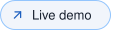

<picture>
  <source media="(max-width: 600px) and (prefers-color-scheme: dark)" srcset="assets/banner-mobile-dark-f412653.svg">
  <source media="(max-width: 600px)" srcset="assets/banner-mobile-light-1f7a3f3.svg">
  <source media="(prefers-color-scheme: dark)" srcset="assets/banner-dark-ffd3e16.svg">
  
</picture>

Hey there 👋🏻

I’m Diogo, a Frontend Software Engineer based in Berlin, with 4+ years of experience.

Here, you can find some of the personal projects and contributions that excite me the most:  
Frontend AI Integrations, UI experiments, and other stuff.
 

<H4>Latest Projects</H4>

Lime AI - a chat client for self-hosted LLMs.

<a href="https://lime-zeta-three.vercel.app"><picture><source media="(prefers-color-scheme: dark)" srcset="assets/demo-dark-9f16866.svg"></picture></a><a href="https://github.com/classiccosta/lime-local-ai"><picture><source media="(prefers-color-scheme: dark)" srcset="assets/repo-dark-c043dc6.svg"></picture></a>

<!-- OSS:START -->
<!-- OSS:END -->

<H4>Stack</H4>

<picture><source media="(prefers-color-scheme: dark)" srcset="assets/tag-react-dark-4c9412f.svg"></picture><picture><source media="(prefers-color-scheme: dark)" srcset="assets/tag-typescript-dark-5b1c632.svg"></picture><picture><source media="(prefers-color-scheme: dark)" srcset="assets/tag-nextjs-dark-6faab4f.svg"></picture><picture><source media="(prefers-color-scheme: dark)" srcset="assets/tag-tailwind-dark-c4fd798.svg"></picture><picture><source media="(prefers-color-scheme: dark)" srcset="assets/tag-scss-dark-76177c1.svg"></picture><picture><source media="(prefers-color-scheme: dark)" srcset="assets/tag-sql-dark-9670a7e.svg"></picture>

<H4>Fun facts</H4>

If I'm not coding, I'm at the tennis court 🎾

<H4>Contacts</H4>

<a href="mailto:cc.diogo@gmail.com"><picture><source media="(prefers-color-scheme: dark)" srcset="assets/email-dark-c5697a8.svg"></picture></a><a href="https://www.linkedin.com/in/classiccosta"><picture><source media="(prefers-color-scheme: dark)" srcset="assets/linkedin-dark-fa10a78.svg"></picture></a>

