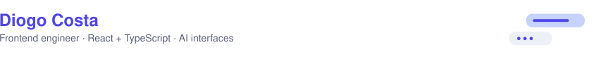
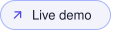

<picture>
  <source media="(max-width: 600px) and (prefers-color-scheme: dark)" srcset="assets/banner-mobile-dark-7ea9056.svg">
  <source media="(max-width: 600px)" srcset="assets/banner-mobile-light-cd8187e.svg">
  <source media="(prefers-color-scheme: dark)" srcset="assets/banner-dark-c0277af.svg">
  
</picture>

Hey there 👋🏻

I’m Diogo, a Frontend Software Engineer based in Berlin, with 4+ years of experience.

Here, you can find some of the personal projects and contributions that excite me the most:  
Frontend AI Integrations, UI experiments, and other stuff.
 

<H4>Latest Projects</H4>

Lime AI - a chat client for self-hosted LLMs.

<a href="https://lime-zeta-three.vercel.app"><picture><source media="(prefers-color-scheme: dark)" srcset="assets/demo-dark-56ff929.svg"></picture></a><a href="https://github.com/classiccosta/lime-local-ai"><picture><source media="(prefers-color-scheme: dark)" srcset="assets/repo-dark-fd4cc3a.svg"></picture></a>

<!-- OSS:START -->
<!-- OSS:END -->

<H4>Stack</H4>

<picture><source media="(prefers-color-scheme: dark)" srcset="assets/tag-react-dark-fe6ae4e.svg"></picture><picture><source media="(prefers-color-scheme: dark)" srcset="assets/tag-typescript-dark-877291e.svg"></picture><picture><source media="(prefers-color-scheme: dark)" srcset="assets/tag-nextjs-dark-0d6b679.svg"></picture><picture><source media="(prefers-color-scheme: dark)" srcset="assets/tag-tailwind-dark-d32c90c.svg"></picture><picture><source media="(prefers-color-scheme: dark)" srcset="assets/tag-scss-dark-044078f.svg"></picture><picture><source media="(prefers-color-scheme: dark)" srcset="assets/tag-sql-dark-b7f9b28.svg"></picture>

<H4>Fun facts</H4>

If I'm not coding, I'm at the tennis court 🎾

<H4>Contacts</H4>

<a href="mailto:cc.diogo@gmail.com"><picture><source media="(prefers-color-scheme: dark)" srcset="assets/email-dark-f5d9caa.svg"></picture></a><a href="https://www.linkedin.com/in/classiccosta"><picture><source media="(prefers-color-scheme: dark)" srcset="assets/linkedin-dark-7724014.svg"></picture></a>

